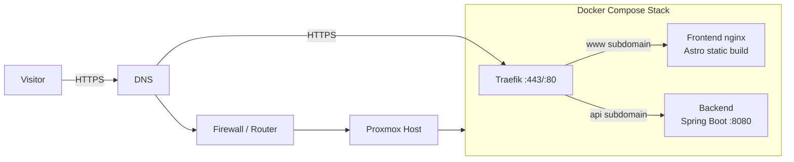
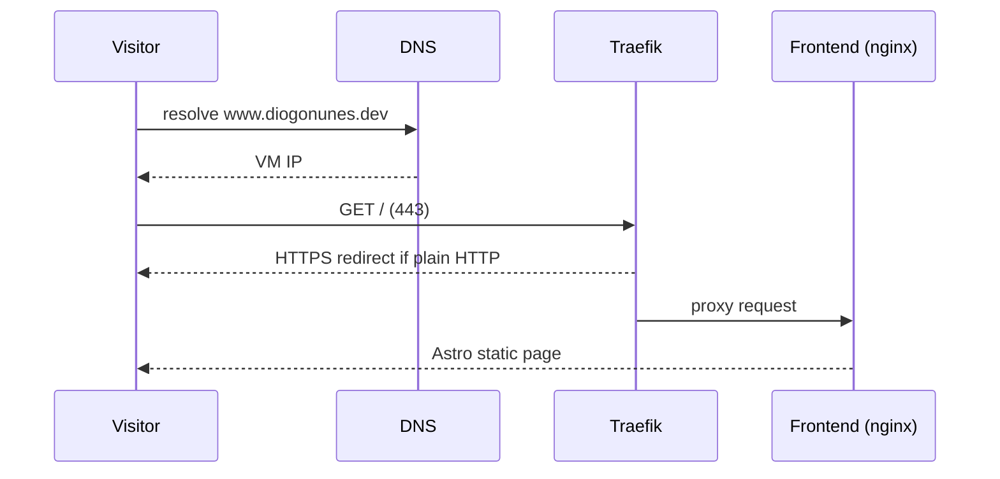
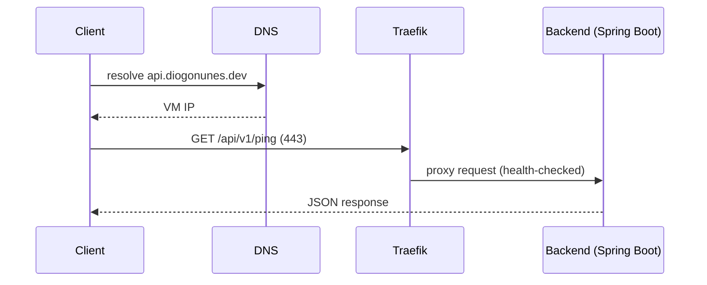
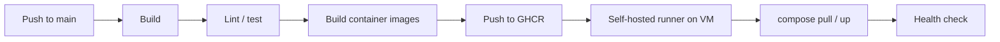

# Architecture

## 1. Overview

A self-hosted personal portfolio platform. The website is the visible surface; the
deployment, operation, and maintenance of the whole platform are the actual project.

### MVP Scope

**Infrastructure**

- Domain (pending purchase)
- DNS records
- HTTPS (Let's Encrypt)
- Traefik reverse proxy
- Deployment pipeline

**Frontend (Astro)**

- Home
- About
- Projects
- CV

**Backend (Spring Boot)**

- Running in production
- Health endpoint (`/actuator/health`)
- One real endpoint (`GET /api/v1/ping`)

**Content**

- One project page
- One blog post

### Non-Goals (MVP)

- No Grafana
- No Prometheus
- No homelab dashboard
- No AI experiments page
- No authentication
- No database
- No Kubernetes

These are deferred to later phases (see master plan).

---

## 2. High-Level System



---

## 3. Deployment Topology

- Single host: a dedicated VM on Proxmox that hosts services — the portfolio
  stack for now, potentially more later (hence "Portfolio Host").
- Docker Compose runs the whole stack on that VM; no orchestration for MVP.
- Only ports `80` and `443` are exposed to the host. Traefik owns them; no other
  container publishes ports to the host interface.
- Containers talk to each other over the Compose internal network.
- Application state is minimal (no DB), so no persistent volumes are required
  for the MVP. Logs go to stdout and are collected via `docker logs`/file.

---

## 4. Components

### 4.1 Frontend — Astro

- Static site generated from Astro; output served by a small `nginx` container
  inside the stack.
- Content lives in Astro content collections as Markdown:
  - `src/content/projects/` — project pages
  - `src/content/blog/` — blog posts
- Pages for MVP: Home, About, Projects, CV.
- Contact links in footer.

### 4.2 Backend — Spring Boot

- Java 21, Spring Boot 4.0.x, containerized (see ADR-002).
- Endpoints:
  - `GET /actuator/health` — used by Traefik for health checks and routing;
    liveness/readiness probes enabled.
  - `GET /api/v1/ping` — demo endpoint returning application info.
- Response shape (foundation for deploy verification):

  ```json
  {
    "service": "portfolio-api",
    "version": "1.0.0",
    "buildTime": "2026-08-13T00:00:00Z",
    "timestamp": "2026-08-13T00:00:00Z"
  }
  ```

  `buildTime` comes from the build; a Git commit hash may be added later.
- No database. Standalone service.
- Configuration via profiles and environment variables (dev vs prod).
- Structured logging to stdout.

**Why keep the backend for MVP?** The project's goal is the full lifecycle of
operating production software, not the website alone. A real JVM service forces the
pipeline to build, test, containerize, deploy, health-check, and route a production
backend — exactly the skills being demonstrated. The ping endpoint validates the
whole path without duplicating the frontend's content system. If it ever stops
earning its keep, it is one container to remove.

### 4.3 Traefik

- Reverse proxy and TLS termination.
- Let's Encrypt certificates via the HTTP-01 challenge.
- HTTP → HTTPS redirect and HSTS.
- Routing rules by subdomain:
  - `www.*` / apex → frontend
  - `api.*` → backend
- Health-check-aware routing to the backend.

### 4.4 DNS

- Domain pending purchase. Placeholder used throughout:
  - apex / `www.diogonunes.dev` → frontend
  - `api.diogonunes.dev` → backend
- Future subdomains reserved: `grafana.*`, `status.*`.
- DNS provider choice is an open decision.

---

## 5. Request Flow

### 5.1 Static site request



### 5.2 API request



---

## 6. CI/CD Pipeline

- **Chosen:** GitHub Actions (repo is on GitHub) with a **self-hosted runner**
  installed on the Portfolio Host VM (see ADR-005).
- The runner connects outbound to GitHub, so no inbound ports are required on
  the VM beyond `80`/`443`.
- Flow on push to `main`:



- Frontend and backend have separate build/test jobs; both deploy through the
  same compose stack on the VM.
- Images are tagged with the git SHA and pushed to GHCR (GitHub Container
  Registry), so every deploy is traceable to a commit.
- **Versioning:** release versions are derived from the current snapshot. On
  push to `main`, CI strips `-SNAPSHOT` (e.g. `0.0.1-SNAPSHOT` → `0.0.1`) and
  tags images with that release version, the git SHA, and `latest`. The
  backend image is built with that version via `REVISION`, so `/api/v1/ping`
  reports the release version. A `bump-develop` job then advances `develop` to
  the next snapshot (`0.0.2-SNAPSHOT`). The source of truth is
  `backend/pom.xml` (`<revision>`) and `frontend/package.json` (`version`).
- The deploy job runs on the self-hosted runner: `docker compose pull`, then
  `docker compose up -d`, followed by a health check against the API.
- The stack runs from `/opt/portfolio/infrastructure` on the VM. Config lives in
  the repo and is synced on every deploy; `.env` and `traefik/certificates/`
  persist on the VM and are never in the repository (ADR-005, ADR-007).
- Secrets (GHCR credentials, runner registration token, environment config)
  come from GitHub Actions secrets, never the repository.

---

## 7. Data & Content

- Source of truth for content: Markdown files in the frontend repo
  (Astro content collections).
- Backend has no persistence for MVP; its response is static application info.
- This keeps content edits simple (a Markdown file + deploy) and the backend
  focused on being a real, production-operated API.

---

## 8. Security

- HTTPS everywhere: Traefik terminates TLS, redirects HTTP, sends HSTS.
- Firewall allows only `80`/`443`; all other ports internal to the VM/stack.
- No secrets committed; everything injected via environment/CI secrets.
- Ports and hosts not required publicly are never published.
- Sensitive homelab details (internal IPs, host specifics) are not exposed in
  public content or API responses.
- Regular image updates and rebuilds assumed as part of operation.

---

## 9. Observability (MVP floor)

- Traefik access logs; backend structured logs to stdout.
- Backend health endpoint used for Traefik routing and manual checks.
- Uptime-style monitoring, metrics dashboards, and centralized logging are
  explicitly deferred to the monitoring phase (master plan).

---

## 10. Open Decisions & Dependencies

| Item | Status | Notes |
| ---- | ------ | ----- |
| Domain purchase | Pending | Blocking DNS and production TLS |
| DNS provider | Open | Must support A records; subdomains needed |
| CI/CD platform | Decided | GitHub Actions + self-hosted runner (ADR-005) |
| Container registry | Decided | GHCR |

---

## 11. Future Evolution

Potential future services (intentional growth, not commitments):

- Grafana dashboards and Prometheus metrics
- Uptime Kuma status monitoring
- Homelab dashboard and service-status API
- AI experiments API
- Contact form / other persistence-backed endpoints

Each would follow the same pattern: a documented service in the compose stack,
routed through Traefik, on its own subdomain. Decisions are deferred until there
is a concrete need, and are recorded as ADRs when made.

---

## 12. MVP Roadmap Mapping

| Architecture component | MVP requirement | Status |
| ---------------------- | --------------- | ------ |
| DNS + domain | Infrastructure: Domain, DNS | Pending |
| Traefik | Infrastructure: HTTPS, Traefik | Pending |
| CI/CD pipeline | Infrastructure: Deployment pipeline | Pending |
| Astro frontend | Frontend: Home, About, Projects, CV | Pending |
| Spring Boot backend | Backend: health + `/api/v1/ping` | Pending |
| Content collections | Content: one project, one blog post | Pending |
| Proxmox host + Compose | Infrastructure: hosting | Pending |

---

## 13. What Success Looks Like

A visitor reaches `diogonunes.dev` over HTTPS, sees a portfolio (Home, About,
Projects, CV) backed by Markdown content, and can hit `api.diogonunes.dev/api/v1/ping`
to reach a real Spring Boot service — all deployed automatically from this repo to
a homelab host behind Traefik. Every piece of that chain is documented and
reproducible.
