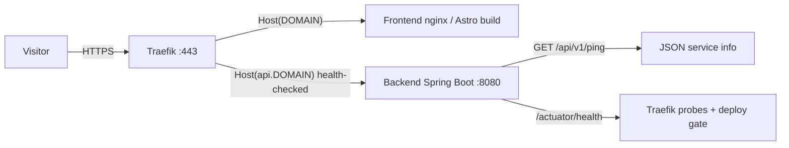

# Code Walkthrough

**Status:** Historical record

**Context:**
The platform was built quickly and iteratively; much of the code predates a
clear understanding of itself. This document is a self-contained tour of the
repository — what each piece is, why it exists, and how it fits together. It is
written for an infra/backend-oriented reader and assumes little frontend
knowledge. It complements `architecture.md` (the system) and `master-plan.md`
(the roadmap) by explaining the _code itself_.

> Line numbers cited below are as of the day this document was written and may
> drift; treat them as pointers, not contracts.

---

## Repository Map

```text
frontend/          Astro static site, served by nginx
backend/           Spring Boot API (Java 21), health + ping
infrastructure/    Docker Compose stack, Traefik config, provisioning docs
docs/              vision, architecture, master-plan, ADRs, this tour
.github/workflows/ GitHub Actions pipeline (build/test/push/deploy)
```

Every consequential choice is recorded in `docs/adr/` (ADR-001..007).

---

## Backend (Spring Boot)

Deliberately tiny: 5 Java files, 3 test files, no database (ADR-003).

### Entry point

`PortfolioApplication.java` is a standard Spring Boot bootstrap —
`@SpringBootApplication` component-scans the `com.diogonunes.portfolio` package.

### Endpoints

The entire API surface lives in `PingController.java`:

- `GET /api/v1/ping` — the one hand-written endpoint. Returns a `PingResponse`
  record (`service`, `version`, `buildTime`, `timestamp`).
- `GET /actuator/health` — provided by `spring-boot-starter-actuator`
  (pom.xml), configured in `application.yml` (only `health`/`info` exposed,
  liveness/readiness probes enabled).

Two non-obvious details:

- `version`/`buildTime` come from `BuildProperties`, injected into the
  controller. It is populated by the `spring-boot-maven-plugin` `build-info`
  goal at package time — so `/api/v1/ping` reports exactly which build is
  running.
- The `Clock` bean (`config/ClockConfig.java`) returns `Clock.systemUTC()`. It
  exists purely for testability: tests swap in a fixed clock.

### Configuration

- `application.yml` — app name, port 8080, actuator exposure, health probes.
- `application-prod.yml` — structured logstash-JSON logging to stdout, activated
  by `SPRING_PROFILES_ACTIVE=prod` in the Dockerfile.

### Tests

- `PingControllerTest` — `@WebMvcTest` slice; stubs `BuildProperties` and a fixed
  `Clock`, asserts the exact JSON shape.
- `HealthEndpointTest` — full application context; verifies actuator `UP` and
  ping end-to-end with real build info.
- `PortfolioApplicationTests` — context-loads smoke test.

### Packaging

Two-stage `Dockerfile`: Maven image builds the jar (`-DskipTests`; tests run in
CI), then a Temurin JRE image runs it as non-root user with
`-XX:MaxRAMPercentage=75`.

---

## Infrastructure & Traefik

### Static vs dynamic Traefik config

Traefik splits config into two layers; the repo honors the split:

- **Static** (`traefik/traefik.yml`) — read once at startup, needs a container
  restart to change. Entrypoints, providers, cert resolver.
- **Dynamic** (`traefik/dynamic.yml` + container labels) — hot-reloaded.
  Routers, middlewares, services.

### `traefik.yml`

- Dashboard enabled but not exposed (no published port — effectively
  unreachable from outside).
- Entrypoints: `web` (`:80`, permanent 301 → `websecure`), `websecure` (`:443`).
- Docker provider with `exposedByDefault: false` — **containers get routes only
  if they opt in via labels**. This is the security-critical flag.
- Let's Encrypt ACME resolver, HTTP-01 challenge via port 80, state in
  `certificates/acme.json` (gitignored, backed up).

### `dynamic.yml`

One shared `security-headers` middleware applied to all routers via compose
labels: HSTS (1y + preload), frame-deny, nosniff, no-referrer, empty
permissions-policy.

### `docker-compose.yml`

Three services on one internal `edge` network; only Traefik publishes ports
(`80`/`443`):

- **traefik** — mounts the Docker socket read-only, both configs, and the
  certificates dir.
- **frontend** — route `Host(${DOMAIN}) || Host(www.${DOMAIN})`, TLS via
  `letsencrypt`, `security-headers` middleware.
- **backend** — route `Host(api.${DOMAIN})`, same TLS/headers, plus Traefik
  health-check polling `/actuator/health` every 30s. Traefik discovers the
  backend port from the `EXPOSE 8080` in its Dockerfile — no `ports:` needed.

### State vs repo split (operational mental model)

- Repo owns: compose file, traefik configs, image tags.
- VM owns: `.env` (real DOMAIN/ACME_EMAIL) and `traefik/certificates/acme.json`.
- Both are gitignored (`infrastructure/.gitignore`, `infrastructure/traefik/.gitignore`).
- Rollback = redeploy a previous `IMAGE_TAG` (git SHA).

---

## CI/CD (`deploy.yml`)

One workflow, three jobs:

1. **frontend** (GitHub-hosted) — `npm ci`, `npm run build`, push image to GHCR
   tagged `SHA` + `latest`.
2. **backend** (GitHub-hosted) — `./mvnw test`, push image tagged `SHA` +
   `latest`.
3. **deploy** (self-hosted runner on the VM, `needs` both) — sync repo
   `infrastructure/` to `/opt/portfolio/infrastructure`, `docker compose pull &&
up -d` with `IMAGE_TAG=<SHA>`, then verify.

Guards: runs on push to `main` + manual dispatch; `packages: write` permission
lets `GITHUB_TOKEN` push to GHCR (ADR-007); concurrency group per ref with
`cancel-in-progress` (last push wins).

Verification details:

- Backend health is checked **inside the container**
  (`docker compose exec backend wget localhost:8080/actuator/health`) so deploy
  success is testable before DNS/certs exist.
- Public `/api/v1/ping` check is a warning only (DNS/LE may still be settling).
- Known TODO: the fixed `sleep 10` before the health check should become a real
  readiness wait (retry/backoff or compose healthcheck). See master-plan.md
  Phase 2 note.

---

## Frontend (Astro)

### Mental model

Astro is a **static site generator**: every `.astro` file runs once at build
time (inside the Docker build) and emits plain HTML. No Node runtime, no
client-side framework by default — nginx serves static files.

Each `.astro` file has a frontmatter block (`---` ... `---`, JavaScript that
runs at build time) and an HTML template with `{expressions}`.

### Structure

```text
src/pages/           file-based routing; each file is a route
src/layouts/         shared HTML shell (BaseLayout)
src/components/      reusable components (Header, Footer)
src/content/         Markdown content collections ("the database")
src/styles/          global.css
public/              static assets copied verbatim (cv.pdf, favicon)
```

### Routing

- `pages/index.astro` → `/`, `pages/about.astro` → `/about`, etc.
- `pages/projects/[slug].astro` and `pages/blog/[slug].astro` — dynamic routes
  pre-rendered at build time.

### Layout & components

`BaseLayout.astro` is the shared shell (analogous to a base class / template).
Pages pass `title`/`description` props; `<slot />` is where page content is
injected. `Header.astro`/`Footer.astro` are the nav and contact links.

### Content collections (the "database")

- Schema (`src/content.config.ts`) — zod schemas define the data contract for
  `projects` and `blog`. A Markdown file that violates the schema **fails the
  build**.
- Rows (`src/content/projects/*.md`, `src/content/blog/*.md`) — Markdown files;
  frontmatter is the typed row data, the body is the content.
- Queries (`pages/projects/index.astro`) — `getCollection()` fetches and sorts
  rows at build time.
- Parametrized pages (`pages/projects/[slug].astro`) — `getStaticPaths()`
  generates one HTML file per row ahead of time.

Editing content = "write a Markdown file, push to main." No DB, no runtime
queries (ADR-003).

### Packaging

Two-stage `Dockerfile`: node:22-alpine builds `dist/`, then `nginx:alpine`
serves it with a minimal `nginx.conf` (static files + gzip). The production
image has no Node at all.

---

## How the pieces connect



Push to `main` → GitHub Actions builds/tests both apps → SHA-tagged images to
GHCR → self-hosted runner pulls and `compose up` on the VM → health check gate →
Traefik routes `www`/apex to nginx and `api` to Spring Boot. Full rationale in
`architecture.md` and the ADRs.
